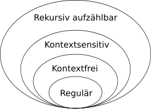

# Grammatiken

### Formaler Aufbau

Eine Grammatik ist eine Sammlung von Ersetzungsregeln (auch Produktionsregeln oder Ableitungsregeln), aus denen Wörter von formalen Sprachen gebildet werden können. Die formalen Grammatiken sind ähnlich zu den Grammatiken der natürlichen Sprache, welche den Aufbau eines Satzes (ein Satz ist hier das äquivalent zum Wort) vorgeschrieben wird. Es wird unterschieden zwischen den sogenannten **Terminalsymbolen** und den **Nichtterminalsymbolen**. Die Ersetzungsregeln einer Grammatik benötigen immer mindestens ein Nichtterminalsymbol, um daraus eine andere Zeichenkette abzuleiten. Die Terminalsymbole entsprechen dem Alphabet, aus dem eine Sprache erzeugt wird. Alle Wörter, welche durch endlich lange Anwendung der Regeln einer Grammatik abgeleitet werden können ilden dann die formale Sprache, die von der Grammatik erzeugt wird.

#### Formale Definition

Eine Grammatik besteht aus:

- Einer endlichen, nichtleeren Menge an Nichtterminalsymbolen N
- Einer endlichen, nichtleeren Menge an Terminalsymbolen T (das Alphabet)
- Einer endlichen, nichtleeren Menge an Ersetzungsregeln P
- Einem Startsymbol S ∈ N

Die Ersetzungsregeln habe dabei die Form α -> β, wobei α und β jeweils Zeichenketten beliebiger Länge sind, die Zeichen aus N und/oder T enthalten. Die einzige Forderung ist, dass α mindestens ein Nichtterminalsymbol enthält.

Mehrere Ersetzungsregeln, bei denen α identisch ist dürfen mit einer oder Verknüpfung zusammengefasst werden:

α -> β  
α -> γ  
wird zusammengefasst als  
α -> β | γ

### Beispiel:

N = {S, B}  
T = {a, b, c}  
P = {  
S -> aSBc | abc  
cB -> Bc  
bB -> bb  
}  

Man fängt bei dem Startsymbol S an und ersetzt dies durch eine der erlaubten Zeichenketten (also aSBc oder abc). Anschließend kann man eine weitere Produktionsregel anwenden, bis man (nach endlich vielen Schritten) keine Nichtterminalsymbole mehr übrig hat. Ein möglicher Ablauf (Erzeugung/Produktion/Ableitung) könnte zum Beispiel sein:

S -> aSBc  
aSBc -> aabcBc (S -> abc)  
aabcBc -> aabBcc (cB -> Bc)  
aabBcc -> aabbcc (bB -> bb)  

Diese Grammatik erzeugt alle Wörter der Sprache { anbncn | n >= 1 }.

### Chomsky-Hierarchie:

Die Chomsky-Hierarchie unterteilt Grammatiken anhand von Kriterien in vier Typen, welche aufsteigend strikter werden. Es gilt, dass Grammatiken, welche den höheren Typen entsprechen, auch den niedrigeren inplizit entsprechen. Dasselbe gilt auch für die von den Grammatiken erzeugten Sprachen, sie können auf dieselbe Art eingeteilt werden.

#### Typ 0 - Unbeschränkte Grammatiken

Die **unbeschränkten Grammatiken**, auch rekursiv aufzählbar genannt, beinhalten alle Grammatiken. Sie entsprechen genau allen semi-entscheidbaren Sprachen. Für semi-entscheidbare Sprachen gilt, es gibt einen Algorithmus sodass:

- Der Algorithmus wenn das Wort in der Sprache ist irgendwann (nach endlicher Zeit) aufhört und ausgibt, dass das Wort in der Sprache ist (das Wort akzeptiert).
- Der Algorithmus wenn das Wort nicht in der Sprache ist das Wort nicht akzeptiert, aber eventuell unendlich lange läuft.

Das Halteproblem ist ein klassisches Beispiel für eine Typ 0 Sprache

#### Typ 1 - Kontextsensitive Grammatiken

Die **kontextsensitiven Grammatiken** erzwingen die Entscheidbarkeit von Sprachen, das heißt, dass sich für jedes Wort in endlicher Zeit entscheiden lässt, ob es in der Sprache ist, oder nicht, und nicht nur bei Wörtern, welche tatsächlich in der Sprache liegen. Das Problem bei unbeschränkten Grammatiken liegt darin, dass die Wortlänge des erzeugten Wortes während der Erzeugung nicht nur größer, sondern auch kleiner werden kann. Man ist sich also nie garantiert sicher, dass sich ein Wort nicht vielleicht doch noch erzeugen lässt. Die kontextsensitiven Grammatiken definieren, dass bei der Ableitungsregel das Wort nicht mehr kürzer werden darf, also |α| <= |β|. Für das leere Wort muss eine Ausnahme gemacht werden, da ansonsten keine kontextsensitive Sprache das leere Wort enthalten könnte. Daher ist die Ableitung S -> ε explizit erlaubt, solange S in keiner Ersetzungsregel auf der rechten Seite steht.  
Die oben gezeigte Grammatik für die Sprache { anbncn | n >= 1 } ist ein Beispiel für eine kontextsensitive Grammatik.

#### Typ 2 - Kontextfreie Grammatiken

Ein Problem mit kontextsensitiven Grammatiken ist, dass die Ableitung von Nichtterminalsymbolen von den umliegenden Terminalsymbolen abhängt. Man muss also beim Ableiten immer auf den richtigen *Kontext* achten und Terminalsymbole sind auch nicht immer final und können sich noch ändern. Die **kontextfreien Grammatiken** fordern, dass auf der linken Seite der Ableitungsregeln immer nur genau ein Nichtterminalsymbol stehen darf. Eine Sonderbehandlung des leeren Wortes ist hier nicht mehr notwendig, dies darf nun immer auf der rechten Seite einer Regel stehen.

##### Backus-Naur-Form

##### Syntaxbaum

##### Pumping-Lemma

#### Typ 3 - Reguläre Grammatiken

